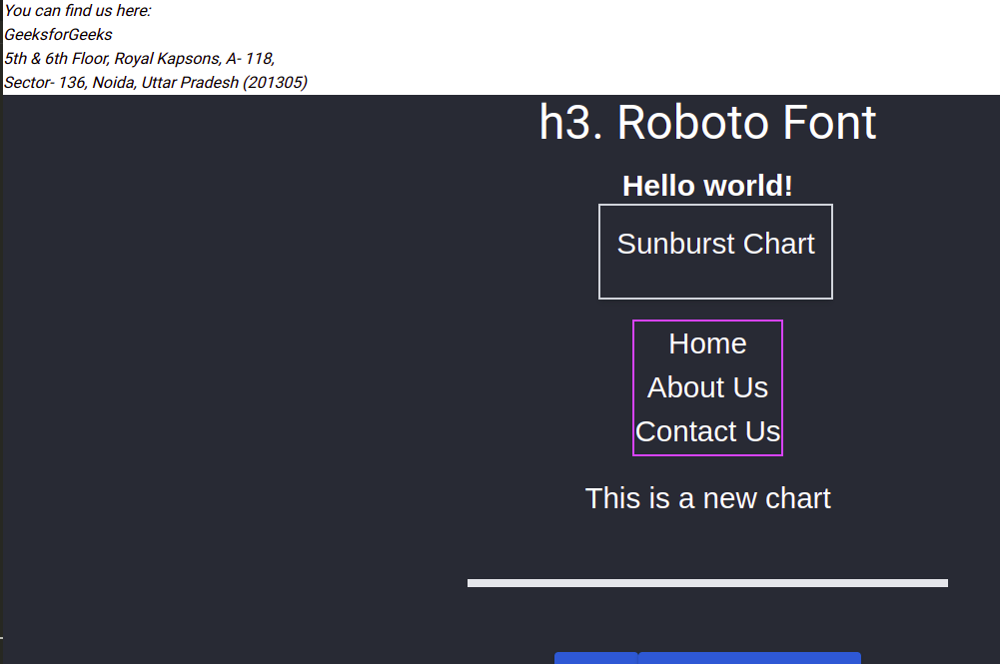

<!-- prettier-ignore -->
this is where I'll explain the process:

### Setup

okay so copy pasting the `package.json` file straight up didn't work,

```
npm ERR! notarget No matching version found for prop-types@>16.0.0.
npm ERR! notarget In most cases you or one of your dependencies are requesting
npm ERR! notarget a package version that doesn't exist.

npm ERR!     /home/axsae/.npm/_logs/2022-02-21T19_19_09_044Z-debug-0.log
```

trying `create-react-app` route and then maybe the default way.

`npx create-react-app react-chart-app` - lol somehow I have it globally installed but it doesn't show up what.

apparently that command is deprecated, hence this is the new one
`npx create-react-app react-chart-app`

wait this causin errors too? somehow there's a global installation ayo wth

got it working finally. yessir let's fucking go.

Also `data.js` is basically useless, completely replaced by `data-color.js`

Have to try and Classify the languages I know.

#### The 4 types of Programming Language that are classified are:

- Procedural Programming Language.
- Functional Programming Language.
- Scripting Programming Language.
- Logic Programming Language.
- Object-Oriented Programming Language.

`/home/axsae/Desktop/to-self-with-love/talents` this has all the things I kinda know about lol.

`reportWebVitals`
[Measuring Performance](https://create-react-app.dev/docs/measuring-performance/)

oh I just noticed there's a `reportWebVitals.js` in the src directory

migrating CRA(Create React App) to Next.js Application - [migration](https://nextjs.org/docs/migrating/from-create-react-app)
is a proper guide that I can use perhaps?

well I'm gonna try out react libraries one by one.

1. Material UI (MUI)
   there's two libraries for CSS-in-JS

- styled components
- emotion
- it is working just had to skip it to the end of the project.


well I'm stuck sitting ducks so fuck me ig.

I need to get back to javascript and how they work.

no matter where I import it I can't get to use the `useScript`


I can't get `react-router-dom` to work at all like bruh, 

learning how to react route from gfg

I added all the things I knew and it still doesn't work.

this is weird routes, because we're still on different routes but nothing much changed for some reason.
the layout still remains the same.



I can't get the navbar to work bruh ripp

we need the `exact` keyword


--- 
14th April

I can't figure out how these shits work.

had to commend out the `Link` tag in `main.jsx`

none of the Link shits work at all.